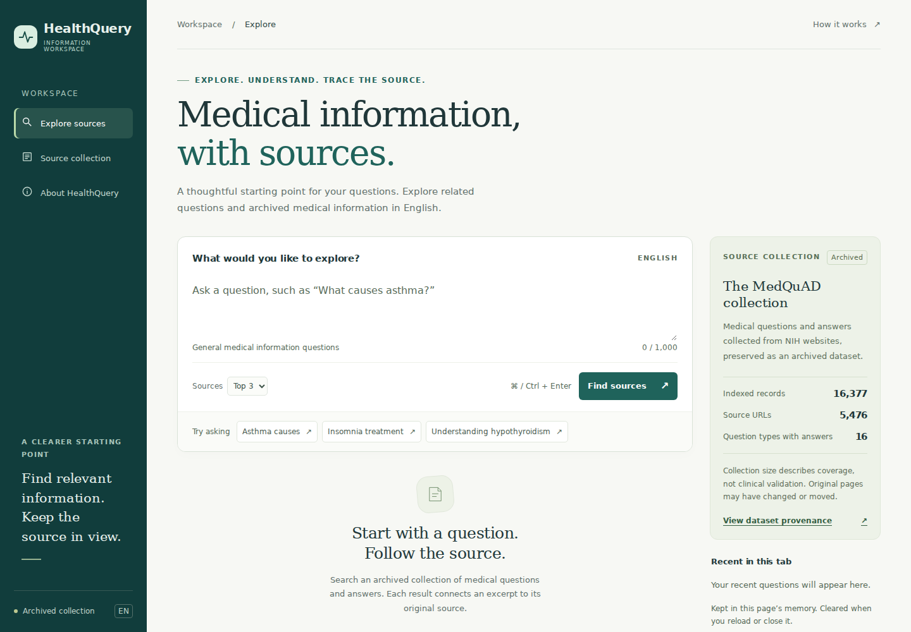

# HealthQuery



**Version 2.0:** responsive search workspace, archived-source reader, citation copying, request protections, structured operational logs, and browser verification. [What changed](docs/PRODUCT_V2.md) · [Operating guide](docs/OPERATIONS.md)

English medical-information search with source-linked results, an experimental question-type classifier, and reproducible evaluation.

HealthQuery indexes **16,377 archived question-answer records from 5,476 source URLs**. It provides a FastAPI service, browser interface, CLI, automated tests, and Docker packaging. It supports medical-information exploration for research and education. It does not assess medical urgency or provide diagnoses; see the concrete commercial-launch acceptance work in the operating guide.

**Stack:** Python · scikit-learn · TF-IDF · logistic regression · FastAPI · pytest · Docker · GitHub Actions

## What the application does

1. Validate an English information question.
2. Predict one of 39 question types as experimental metadata.
3. Retrieve records using separate question/focus and answer TF-IDF indexes, with fixed equal-weight cosine scores.
4. Return up to three distinct source URLs by default, with archived excerpt previews.

The classifier does not filter retrieval results. Similarity scores are not confidence probabilities. The UI displays existing dataset excerpts; there is no generative model or live web search.

## Results and decisions

Three predefined retrieval designs were compared on the same frozen **24 assistant-authored development queries**, with partial record-level relevance judgments:

| Retrieval design | Hit@1 | Hit@3 | MRR@3 |
|---|---:|---:|---:|
| Question + focus | 0.3333 | 0.5833 | 0.4444 |
| Concatenated question + focus + answer | 0.3750 | 0.5417 | 0.4583 |
| Separate fields, fixed 50/50 blend — selected | 0.3333 | 0.6250 | 0.4792 |

The selected design finds a labeled relevant record in the top three for **15/24 queries, compared with 14/24**. This is a small development-set gain, not evidence of generalization. It costs more memory and search time. The simpler baseline remains reproducible.

The classifier's template-heavy validation accuracy was 1.0000, while its 32-question paraphrase challenge accuracy was **0.3438**. The interface labels classification as experimental. This gap is documented rather than presented as 100% real-world accuracy.

The original v1 reference release passed **54 automated tests**. Its 120 sequential loopback HTTP requests measured **p50 28.65 ms / p95 62.06 ms** on the recorded Linux/Python 3.12 environment. These measurements include classification and retrieval, exclude startup, and do not predict cloud latency or concurrent capacity.

See [results and limitations](docs/RESULTS.md), [reference reports](reports/reference_v1/), and the [evaluation protocol](evaluation/RETRIEVAL_EVALUATION.md).

## Run from a clean checkout

Python 3.12 or 3.13 and Git are needed. The Docker image and CI use Python 3.13; the reference local checks ran under Python 3.12.

```bash
git clone https://github.com/ryan30402/healthquery.git
cd healthquery
python3 -m venv .venv
source .venv/bin/activate
python -m pip install -r requirements-dev.txt
git clone https://github.com/abachaa/MedQuAD.git data/raw/MedQuAD
git -C data/raw/MedQuAD checkout 577bd37b96c02d1833b2c9eed2de9f96964e96cb
python -m scripts.prepare_data
python -m scripts.finalize
python -m uvicorn api:app --host 127.0.0.1 --port 8000 --workers 1 --no-access-log --no-proxy-headers
```

Open `http://127.0.0.1:8000`. The API schema is at `/openapi.json`; `/ready` reports readiness after artifact checks and warmup. Try `What causes asthma?`. To use the terminal interface, run `python app.py` instead of Uvicorn.

If the processed data already exists, start with dependency installation and `python -m scripts.finalize`. The finalizer rebuilds the classifier and all three retrieval candidates, evaluates them, runs tests, and measures local HTTP latency. It stops if a command fails. Restart any existing server after it finishes so the new artifacts are loaded.

The finalizer writes your measurements under `reports/`; `reports/reference_v1/` contains the original reference release. Performance varies across machines. A successful local finalizer run does not establish a successful Docker build, remote CI run, or cloud deployment.

## Test and evaluate separately

```bash
python -m pytest -q
python -m scripts.evaluate_challenge
python -m scripts.evaluate_retrieval
python -m scripts.benchmark
```

Tests use synthetic fixtures and run without the real corpus or model files. The evaluation and benchmark commands require locally built artifacts. `scripts/build_index.py --help` exposes all three index modes; `scripts/evaluate_retrieval.py` accepts alternative index and report paths. Use `python -m scripts.build_index --help` from the repository root.

## Containers and publication

[ENGINEERING.md](ENGINEERING.md) explains the local development container with a read-only model mount. [DEPLOYMENT.md](docs/DEPLOYMENT.md) exports a standalone container containing the evaluated artifacts and explains how to publish it as a Hugging Face Docker Space.

The CI workflow runs synthetic tests, builds the development image, mounts temporary browser-test models, and drives Chromium against the container. Check the actual Actions run after pushing; building an image alone does not verify that real models load. A public deployment is optional for the portfolio; link a working deployment only after checking it.

## Repository map

| Path | Purpose |
|---|---|
| `api.py`, `app.py`, `web/` | API, CLI, and English browser interface |
| `retrieval.py`, `retrieval_metrics.py` | Ranking and evaluation metrics |
| `scripts/prepare_data.py`, `scripts/train_baseline.py` | Pinned data preparation and grouped classifier training |
| `scripts/build_index.py`, `scripts/evaluate_*.py` | Search indexes and reproducible evaluations |
| `scripts/finalize.py`, `scripts/benchmark.py` | Local release checks and measured latency |
| `scripts/export_space.py` | Self-contained deployment export |
| `evaluation/`, `tests/`, `reports/` | Development judgments, behavior tests, and evidence |
| `docs/` | Results, deployment, demo outline, and resume wording |

Raw data, virtual environments, and binary model artifacts are excluded from Git and rebuilt locally. Only load joblib artifacts produced by trusted project code. See [DATA_SOURCES.md](DATA_SOURCES.md) for MedQuAD attribution and archived-content restrictions.

## Boundaries and next work

The source links and medical currency have not been checked. The application has no general out-of-domain detector, clinician evaluation, authentication, or coordinated cross-replica/user quotas. Process-local peer limits protect query and archived-reader routes. Displayed previews may omit relevant text later in the full answer. Development judgments are incomplete, and neither evaluation set is an independent real-user sample.

Future work would prioritize a separately collected evaluation set, reviewed relevance judgments, better paraphrase classification, and retrieval alternatives evaluated against the same protocol. This release deliberately preserves measurable limitations alongside the runnable system.

## v2 verification

See [product verification](reports/product_v2_checks.json) and [browser report](reports/product_v2_browser.json). V2 adds artifact-readiness checks, a bounded request guard, and real Chromium workflow checks. The historical v1 quality reports remain unchanged because this UI/service release does not alter the retrieval algorithm. New latency results are in [the v2 report](reports/product_v2_latency.json), including its isolated benchmark quota override.
